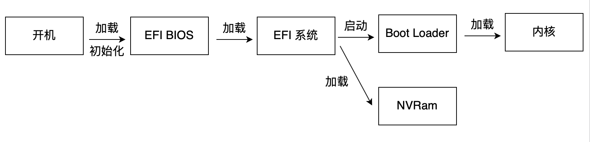

Linux 启动流程

[linux启动流程](https://docs.google.com/document/d/1C5f9Ey39yZyiMiYvS9kolPltjuoaXtpsN4dJjTnR578/edit)

BIOS
MBR
GRUB
Kernel
Init
Runlevel

[Vmlinux的启动](https://xydong.gitee.io/seedx/post/linux/before_start_kernel/)  
[Linux启动流程](https://www.binss.me/blog/boot-process-of-linux/)  
