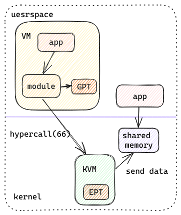

# Introduction
This is a hypercall-based way for VM to communicate with the host, inspired by [open-vm-tools](https://github.com/vmware/open-vm-tools). There are several features:
1. Modify kernel kvm module to add hypercall;
2. Manually simulate address translation for GPT and EPT(though it's not necessary, but for fun);
3. Guest and host communication based on shared memory;

This is just a prototype and needs more work.

# Architecture

(TODO: add more detail)

# Usage steps:

## On host
> Based on 4.19.90-2307.3.0.oe1.smartx.33.x86_64

### Compile and install shred memory module
```bash
cd new-vmtools/host
make all
# this will generate module_shared.ko
sudo insmod module_shared.ko
# create device file, {major} can be found in `dmesg`
mknod /dev/my_shared_mem c {major} 0
```

### Replace host KVM module
```bash
# compile kvm based on 4.19.90-2307.3.0.oe1.smartx.33.x86_64
git clone -b 4.19.90-2307.3.0.oe1.smartx.33 git@newgh.smartx.com:kernel/kernel.git
cd kernel
cp /boot/config-4.19.90-2307.3.0.oe1.smartx.33.x86_64 ./.config
# apply patch: 0001-add-new-hypercall-and-add-mmu-walker.patch
make olddefconfig
make -j$(nproc) > compile.log
make modules SUBDIRS=arch/x86/kvm
# this will generate kvm.ko and kvm_intel.ko

# remove old kvm module
modprobe -r kvm_intel && modprobe -r kvm

# install new kvm module
modprobe irqbypass && insmod kvm.ko && insmod kvm-intel.ko
```

### Compile host app
```bash
cd host
gcc read_shared_mem.c -o read_shared_mem
./read_shared_mem  # read shared memory allocated by module_shared.ko
```

## On guest
> Based on openeuler-20.03 LTS SP4

### Compile guestping module
```bash
cd new-vmtools/guest
make all
# this will generate guestping.ko
sudo insmod guestping.ko
# create device file, {major} can be found in `dmesg`
mknod /dev/guestping c {major} 0
```

### Compile guest app
```bash
gcc send_guestping -o guest_user
./guest_user
```

# Execution
## Guest app send message
```bash
$ ./guest_user
message sent

$ dmesg
guestping opened
get message: message from userspace!
Value is: 4276993775
GVA [PGD IDX] [PUD IDX] [PMD IDX] [PTE IDX] [  Offset  ]
GVA 100110000 111000111 010110001 110111101 100110111000
NEXT_LVL_GPA(CR3)  =  0000000000000000000100101101101001101100  +  8 * 304
304: PGD 000000000000 0000000000000000000100100100110000000001 000001100111
NEXT_LVL_GPA(PGD)  =  0000000000000000000100100100110000000001  +  8 * 455
455: PUD 000000000000 0000000000000000000100100100110000000101 000001100111
NEXT_LVL_GPA(PUD)  =  0000000000000000000100100100110000000101  +  8 * 177
177: PMD 000000000000 0000000000000000000100010110001000101001 000001100011
NEXT_LVL_GPA(PMD)  =  0000000000000000000100010110001000101001  +  8 * 445
445: PTE 100000000000 0000000000000000000100010110001110111101 000001100011
GPA 0000000000000000000100010110001110111101 100110111000
guestping closed.
```
The message sent from guest to host is 4276993775.

## Host app receive message
```bash
$ ./read_shared_mem
Data from kernel: 4276993775

$ dmesg
GPA [PGD IDX] [PUD IDX] [PMD IDX] [PTE IDX] [  Offset  ]
GPA 000000000 000000100 010110001 110111101 100110111000
Normal Page (4k) at level 1 detected!
GPA   000000000000 0000000000000000000100010110001110111101 100110111000
HVA   000000000 000000011 111110111 011011011 111011101111
HPA   000000000000 0000000000000000001001100110000010110110 100110111000
Value from guest: 4276993775
shared memory data: 4276993775
```
The message received from guest is 4276993775, guest sent message to host successfully.
