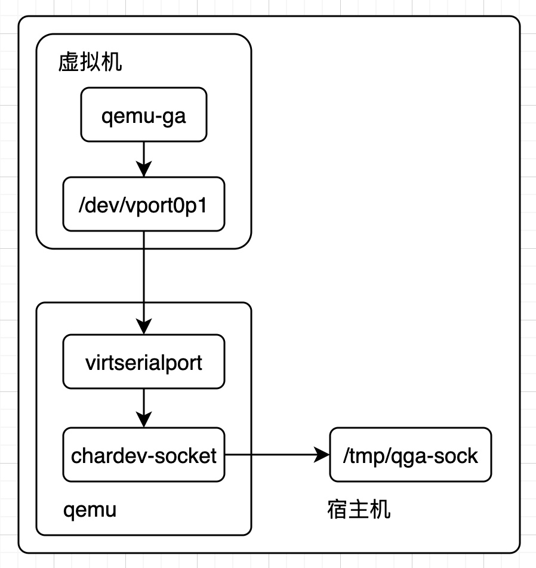
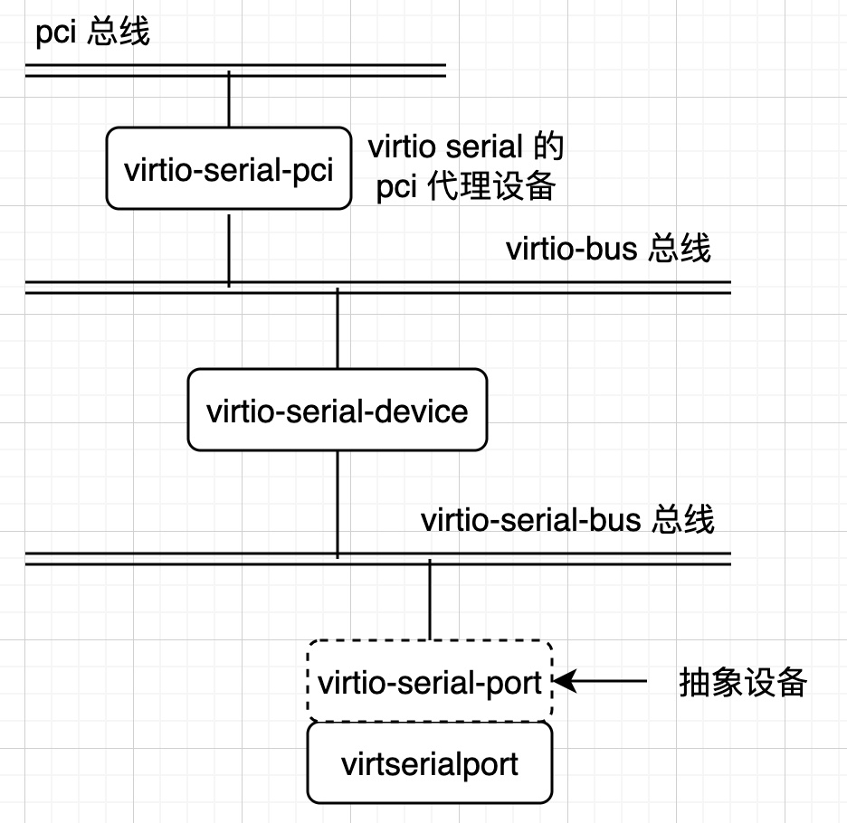
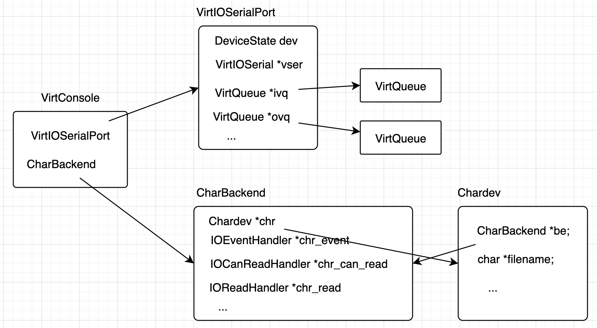

# qemu-ga 介绍
添加设备的 controller 
```xml
<controller type='virtio-serial' index='0' ports='2'>
  <alias name='virtio-serial0'/>
  <address type='pci' domain='0x0000' bus='0x00' slot='0x08' function='0x0'/>
</controller>
```

http://blog.nsfocus.net/easy-kvm-virtualization/
https://blog.csdn.net/yzy1103203312/article/details/81661450
https://blackskygg.github.io/2016/08/17/virtio-host-guest-communication/


添加串口设备
```xml
<channel type='unix'>
  <source mode='bind' path='/var/lib/libvirt/qemu/channel/target/domain-2-abc1f073-d7e6-4f0d-9/org.qemu.guest_agent.0'/>
  <target type='virtio' name='org.qemu.guest_agent.0' state='connected'/>
  <alias name='channel0'/>
  <address type='virtio-serial' controller='0' bus='0' port='1'/>
</channel>
```

上述 xml 转化为 qemu 参数如下：
```sh
-device virtio-serial-pci,id=virtio-serial0,max_ports=2,bus=pci.0,addr=0x8 
-chardev socket,id=charchannel0,fd=51,server,nowait 
-device virtserialport,bus=virtio-serial0.0,nr=1,chardev=charchannel0,id=channel0,name=org.qemu.guest_agent.0 
```
各参数含义如下：  
`-device virtio-serial-pci`  
创建一个 `virtio-serial` 的 PCI 代理设备，其初始化时会创建一条 `virtio-serial-bus`，用来挂载 `virtioserialport` 设备。

`-chardev socket`  
指定了一个字符设备，其后端设备对应为 `unix socket`，名字为 `virio-serial0`，在宿主机中可以看到类似于 `/var/lib/libvirt/qemu/channel/target/domain-42-fea480aa-5e8d-4eda-8/org.qemu.guest_agent.0` 的 socket 文件。

`-device virtserialport`  
创建一个 `virioserialport` 设备，其对应的 chardev 是 `virio-serial0`，名字是 `org.qemu_agent.0`，该设备会挂到 `virio-serial-bus` 上面，在虚拟机中我们就可以看到 `/dev/virtio-ports/org.qemu.guest_agent.0` 设备。

qemu 创建好了上述的设备之后，在虚拟机中执行 `qemu-ga --method=virtio-serial --path=/dev/virtio-ports/org.qemu.guest_agent.0`，就可以连接 `/dev/virtio-ports/org.qemu.guest_agent.0` 串口设备。在宿主机端可以连接 `/var/lib/libvirt/qemu/channel/target/domain-42-fea480aa-5e8d-4eda-8/org.qemu.guest_agent.0` 这个 `unix socket`，从而与虚拟机内部的 qemu-ga 通信，比如在宿主机端执行 guest-ping，虚拟机端的 qemu-ga 就返回执行结果。


# qemu-ga 原理
qemug-ga 的架构如下：



qemu 创建一个 `virtserialport` 串口设备，该串口设备还有一个 `chardev` 设备，提供虚拟机与外部设备的连接、数据传输等，对应的后端为 `unix socket`，对应的文件是 `/tmp/qga.sock`，qemu 还会将该 socket 文件的 fd 加入事件监听的主循环中。

当向虚拟机发送 qemu-ga 请求命令时，比如设置或获取一些信息，就要向 `unix socket` 文件写入请求数据，数据的格式与 qmp 命令一样也是 json。当 socket 收到数据时就会唤醒 qemu 的主循环，串口设备读取数据，然后填写 virtio 的 ring，向设备注入一个中断。

虚拟机中的设备接收到这个中断之后会读取数据，并唤醒用户态的 qga 进程。qemu-ga 本身有一个事件循环来监听 `/dev/vport0p1` 的数据，当它被唤醒时就会处理请求并生成应答数据，应答数据的格式也是 json。 应答数据通过 virtio 串口设备向 qemu 发送数据，qemu 则通过 chardev 设备向宿主机上的 `unix socket` 文件发送其应答数据。

上面是 qemu-ga 的大概运行原理。接下来我们从源码角度具体分析其原理。

qemu-ga 的执行入口如下：
```c
int main(int argc, char **argv)
{
   int ret = EXIT_SUCCESS;
   GAState *s = g_new0(GAState, 1);
   GAConfig *config = g_new0(GAConfig, 1);
   int socket_activation;
   …
   // 注册 qmp 命令
   qga_qmp_init_marshal(&ga_commands);

   init_dfl_pathnames();
   config_load(config);
   config_parse(config, argc, argv);
   …

   s->log_level = config->log_level;
   s->log_file = stderr;
#ifdef CONFIG_FSFREEZE
   s->fsfreeze_hook = config->fsfreeze_hook;
#endif
   s->pstate_filepath = g_strdup_printf("%s/qga.state", config->state_dir);
   s->state_filepath_isfrozen = g_strdup_printf("%s/qga.state.isfrozen",
                                                config->state_dir);
   s->frozen = check_is_frozen(s);
   …

   // 运行 agent
   ret = run_agent(s, config, socket_activation);
   …
}
```

上述的代码分为两部分，第一部分是初始化（配置、qmp 命令），第二部分是运行 qemu-ga。

第一部分初始化的部分主要包括记录 qemu-ga 在运行期间的状态和配置以及通过 qapi 注册 qemu-ga 支持的各种命令。

记录 qemu-ga 状态的结构体如下：
```c
struct GAState {
   JSONMessageParser parser;
   GMainLoop *main_loop;
   GAChannel *channel;
   …
   bool frozen;
   GList *blacklist;
   char *state_filepath_isfrozen;
   …
#ifdef CONFIG_FSFREEZE
   const char *fsfreeze_hook;
#endif
   …
};
```
`parser` 主要用来解析 json 对象并调用设置的回调函数。  
`main_loop` 表示 qemu-ga 的主循环。  
`channel` 表示与 `virtioserial` 通信的通道。  
`frozen` 表示当前文件系统是否被 freeze。  
`blacklist` 记录不可执行命令的黑名单。

记录配置信息的结构体如下：
```c
typedef struct GAConfig {
   char *channel_path;
   char *method;
   …
#ifdef CONFIG_FSFREEZE
   char *fsfreeze_hook;
#endif
   …
   gchar *bliststr; /* blacklist may point to this string */
   GList *blacklist;
   int daemonize;
   …
} GAConfig;
```
`channel_path` 表示串行设备的路径。  
`method` 表示串行端口的类型，可以使 virio-serial 或者 isa。  
`daemonsize` 表示是否已守护进程运行。

qemu-ga 的 main 函数首先会分配 GAState 和 GACconfig 结构，并调用 `config_load(config)` 和 `config_parse(config, argc, argv)` 把环境变量和命令行参数解析到 GACconfig，比如`--method=virtio-serial`会把值赋给 `config->method`，`--path=/dev/virtio-ports/org.qemu.guest_agent.0` 会把值赋给 `config->path`。 
`config_load` 和 `config_parse` 会解析配置参数并分配给 `GAConfig`。

初始化的第二部分工作还包括将 qemu-ga 支持的各个命令注册到一个链表中。其注册函数如下：
```c
void qmp_register_command(QmpCommandList *cmds, const char *name,
                          QmpCommandFunc *fn, QmpCommandOptions options)
{
    QmpCommand *cmd = g_malloc0(sizeof(*cmd));

    cmd->name = name;
    cmd->fn = fn;
    cmd->enabled = true;
    cmd->options = options;
    QTAILQ_INSERT_TAIL(cmds, cmd, node);
}
```
qemu-ga 会对所有支持的命令调用 `qmp_register_command`，即利用命令名称、处理函数以及命令参数构造一个 QmpCommand 结构然后插入 QmpCommandList 链表上。

在程序的初始化和 qmp 命令链表构造完成之后，qemu-ga 将开始运行，其主要调用 run_agent 函数。
```c
static int run_agent(GAState *s, GAConfig *config, int socket_activation)
{
    ga_state = s;

    ...

    config->blacklist = ga_command_blacklist_init(config->blacklist);
    if (config->blacklist) {
        GList *l = config->blacklist;
        s->blacklist = config->blacklist;
        do {
            g_debug("disabling command: %s", (char *)l->data);
            qmp_disable_command(&ga_commands, l->data);
            l = g_list_next(l);
        } while (l);
    }

    ...

    // 注册 process_event 函数
    json_message_parser_init(&s->parser, process_event);

    ...

    s->main_loop = g_main_loop_new(NULL, false);

    // 通道初始化
    if (!channel_init(ga_state, config->method, config->channel_path,
                      socket_activation ? FIRST_SOCKET_ACTIVATION_FD : -1)) {
        g_critical("failed to initialize guest agent channel");
        return EXIT_FAILURE;
    }
#ifndef _WIN32
    g_main_loop_run(ga_state->main_loop);
#else
    ...
#endif

    return EXIT_SUCCESS;
}
```
在解析的参数中会把禁止调用的 qga 命令加入到 `config->blacklist`，然后会调用 `qmp_disable_command` 把 `config->blacklist` 中的命令禁止掉（QmpCommand 中的 enabled 改为 false）。接着调用 `json_message_parser_init` 将 `s->parser` 的 emit 函数设置为 process_event，改函数主要用处处理请求。最后创建一个 main_loop，对通道进行初始化，调用 g_main_loop_run 让 qemu-ga 进程进入到事件监听循环中。

上述流程中通道初始化的流程如下：
```c
static gboolean channel_init(GAState *s, const gchar *method, const gchar *path,
                             int listen_fd)
{
    GAChannelMethod channel_method;

    if (strcmp(method, "virtio-serial") == 0) {
        s->virtio = true; /* virtio requires special handling in some cases */
        channel_method = GA_CHANNEL_VIRTIO_SERIAL;
    } else if (strcmp(method, "isa-serial") == 0) {
        channel_method = GA_CHANNEL_ISA_SERIAL;
    } else if (strcmp(method, "unix-listen") == 0) {
        channel_method = GA_CHANNEL_UNIX_LISTEN;
    } else if (strcmp(method, "vsock-listen") == 0) {
        channel_method = GA_CHANNEL_VSOCK_LISTEN;
    } else {
        g_critical("unsupported channel method/type: %s", method);
        return false;
    }

    s->channel = ga_channel_new(channel_method, path, listen_fd,
                                channel_event_cb, s);
    if (!s->channel) {
        g_critical("failed to create guest agent channel");
        return false;
    }

    return true;
}
```
初始化通道首先会根据传入的参数来决定通道的类型，然后调用 `ga_channel_new` 创建一个通道，其本质是调用 `ga_channel_open` 函数打开 virtio 串口设备，得到该设备的 fd，然后调用 `ga_channel_client_add` 将 fd 加入到 qemu-ga 的事件循环中。当该 fd 有数据到达时，会调用 `ga_channel_client_event`，该函数最终会调用到 `channel_event_cb` 函数，函数代码如下：
```c
static gboolean channel_event_cb(GIOCondition condition, gpointer data)
{
    GAState *s = data;
    gchar buf[QGA_READ_COUNT_DEFAULT+1];
    gsize count;
    // 接收数据
    GIOStatus status = ga_channel_read(s->channel, buf, QGA_READ_COUNT_DEFAULT, &count);
    switch (status) {
    case G_IO_STATUS_ERROR:
        g_warning("error reading channel");
        return false;
    case G_IO_STATUS_NORMAL:  // 接收到正常数据
        buf[count] = 0;
        g_debug("read data, count: %d, data: %s", (int)count, buf);
        json_message_parser_feed(&s->parser, (char *)buf, (int)count);
        break;
    case G_IO_STATUS_EOF:
        g_debug("received EOF");
        if (!s->virtio) {
            return false;
        }
        /* fall through */
    case G_IO_STATUS_AGAIN:
        /* virtio causes us to spin here when no process is attached to
         * host-side chardev. sleep a bit to mitigate this
         */
        if (s->virtio) {
            usleep(100*1000);
        }
        return true;
    default:
        g_warning("unknown channel read status, closing");
        return false;
    }
    return true;
}
```
该函数中，如果接收到正常数据，则会调用 `json_message_parser_feed` 来解析传过来的 json 数据并调用 `s->parser` 的 emit 函数（process_event），其核心代码如下：
```c
static void process_event(JSONMessageParser *parser, GQueue *tokens)
{
    GAState *s = container_of(parser, GAState, parser);
    QDict *qdict;
    Error *err = NULL;
    int ret;

    g_assert(s && parser);

    g_debug("process_event: called");
    qdict = qobject_to(QDict, json_parser_parse_err(tokens, NULL, &err));

    ...

    /* handle host->guest commands */
    if (qdict_haskey(qdict, "execute")) {
        process_command(s, qdict);
    } else {
        ...
    }

    qobject_unref(qdict);
}
```
上述的 process_command 会调用 qmp_dispatch：
```c
static void process_command(GAState *s, QDict *req)
{
    QObject *rsp = NULL;
    int ret;

    g_assert(req);
    g_debug("processing command");
    rsp = qmp_dispatch(&ga_commands, QOBJECT(req));
    if (rsp) {
        ret = send_response(s, rsp);
        if (ret < 0) {
            g_warning("error sending response: %s", strerror(-ret));
        }
        qobject_unref(rsp);
    }
}
```
该函数调用 qmp_dispatch，会在 QmpCommandList 链表中找到要调用的命令与函数来执行，并将结果返回，接着则调用 send_response 返回数据。

# qemu-ga qemu 侧原理
在 qemu 侧会创建设备：`virtio-serial-pci`，`virtio-serial-device`，`virtio-serial-port`，`virtserialport`，这些设备的关系如下：


命令行 `-device virtio-serial-pci` 会创建 `virtio-serial` 对应的类型为 `virtio-serial-pci` 的 pci 代理设备，其实例初始化函数为 `virtio_serial_pci_instance_init`。
```c
// hw/virtio/virtio-pci.c
static void virtio_serial_pci_instance_init(Object *obj)
{
   VirtIOSerialPCI *dev = VIRTIO_SERIAL_PCI(obj);
 
   virtio_instance_init_common(obj, &dev->vdev, sizeof(dev->vdev),
                               TYPE_VIRTIO_SERIAL);
}
```
该函数主要调用 `virtio_instance_init_common` 来创建一个 `virtio-serial-device` 设备。  
在 qemu 的 main 函数中，有如下步骤
```c
// vl.c
/* init generic devices */
rom_set_order_override(FW_CFG_ORDER_OVERRIDE_DEVICE);
if (qemu_opts_foreach(qemu_find_opts("device"),
                        device_init_func, NULL, NULL)) {
    exit(1);
}
```

其中 `device_init_func` 会将 `virtio-serical-pci` 设备具现化，调用的函数为 `virtio_serial_pci_realize`.
```c
// hw/virtio/virtio-pci.c
static void virtio_serial_pci_realize(VirtIOPCIProxy *vpci_dev, Error **errp)
{
    VirtIOSerialPCI *dev = VIRTIO_SERIAL_PCI(vpci_dev);
    DeviceState *vdev = DEVICE(&dev->vdev);
    DeviceState *proxy = DEVICE(vpci_dev);
    char *bus_name;

    ...

    qdev_set_parent_bus(vdev, BUS(&vpci_dev->bus));
    object_property_set_bool(OBJECT(vdev), true, "realized", errp);
}
```

接着调用 `virtio_serial_device_realize` 具现化 `virtio-serial-device` 设备，其代码如下：
```c
// hw/char/virtio-serial-bus.c
static void virtio_serial_device_realize(DeviceState *dev, Error **errp)
{
    VirtIODevice *vdev = VIRTIO_DEVICE(dev);
    VirtIOSerial *vser = VIRTIO_SERIAL(dev);
    uint32_t i, max_supported_ports;
    size_t config_size = sizeof(struct virtio_console_config);

    ...

    virtio_init(vdev, "virtio-serial", VIRTIO_ID_CONSOLE,
                config_size);

    /* Spawn a new virtio-serial bus on which the ports will ride as devices */
    qbus_create_inplace(&vser->bus, sizeof(vser->bus), TYPE_VIRTIO_SERIAL_BUS,
                        dev, vdev->bus_name);
    qbus_set_hotplug_handler(BUS(&vser->bus), DEVICE(vser), errp);
    vser->bus.vser = vser;
    QTAILQ_INIT(&vser->ports);

    vser->bus.max_nr_ports = vser->serial.max_virtserial_ports;
    vser->ivqs = g_malloc(vser->serial.max_virtserial_ports
                          * sizeof(VirtQueue *));
    vser->ovqs = g_malloc(vser->serial.max_virtserial_ports
                          * sizeof(VirtQueue *));

    /* Add a queue for host to guest transfers for port 0 (backward compat) */
    vser->ivqs[0] = virtio_add_queue(vdev, 128, handle_input);
    /* Add a queue for guest to host transfers for port 0 (backward compat) */
    vser->ovqs[0] = virtio_add_queue(vdev, 128, handle_output);
    /* control queue: host to guest */
    vser->c_ivq = virtio_add_queue(vdev, 32, control_in);
    /* control queue: guest to host */
    vser->c_ovq = virtio_add_queue(vdev, 32, control_out);

    for (i = 1; i < vser->bus.max_nr_ports; i++) {
        /* Add a per-port queue for host to guest transfers */
        vser->ivqs[i] = virtio_add_queue(vdev, 128, handle_input);
        /* Add a per-per queue for guest to host transfers */
        vser->ovqs[i] = virtio_add_queue(vdev, 128, handle_output);
    }

    vser->ports_map = g_malloc0((DIV_ROUND_UP(vser->serial.max_virtserial_ports, 32))
        * sizeof(vser->ports_map[0]));
    
    ...

    QLIST_INSERT_HEAD(&vserdevices.devices, vser, next);
}
```
上述代码中 `virtio_init` 初始化 `virtio-serial-device` 设备，调用 `qbus_create_inplace` 函数创建一条 virtio 串行总线，该总线上可以挂 virtio 串口设备，分配 `virtio serial device` 自己的 virtqueue（`vser->c_ivq` 和 `vser->c_ovq`） 来控制 virtioserialdevice 设备，分配并初始化 virtio 串口设备的 virtqueue（即 `vser->ivqs` 数组和 `vser->ovqs` 数组）来进行数据传输。  

从虚拟机到宿主机的 virtqueue 的处理函数是 handle_output，从宿主机到虚拟机的 virtqueue 的处理函数是 handle_input，handle_input 只在特殊情况下调用，如虚拟机由于长时间不读取 virtio 串口的数据，导致宿主机不能写，当虚拟机读取了一部分数据之后，就会调用 handle_input 通知宿主机继续写。

***

命令行 `-chardev socket,id=charchannel0,fd=51,server,nowait` 会创建一个后端为 `unix socket` 的 chardev 设备。chardev 设备的共同父类型为 `TYPE_CHARDEV`，各个子类型包括：TYPE_CHARDEV_SOCKET、TYPE_CHARDEV_PTY、 TYPE_CHARDEV_FD 等，每一种子类型使用不同的后端，虚拟机可以通过 chardev 在 qemu main 函数中会调用 `chardev_init_func` 对每一个 chardev 设备进行初始化。

chardev_init_func 函数如下：
```c
// vl.c
static int chardev_init_func(void *opaque, QemuOpts *opts, Error **errp)
{
    Error *local_err = NULL;

    if (!qemu_chr_new_from_opts(opts, &local_err)) {
        if (local_err) {
            error_report_err(local_err);
            return -1;
        }
        exit(0);
    }
    return 0;
}
```

该函数调用 `qemu_chr_new_from_opts` 来创建一个指定的 chardev 设备。
```c
// chardev/char.c
Chardev *qemu_chr_new_from_opts(QemuOpts *opts, Error **errp)
{
    const ChardevClass *cc;
    Chardev *chr = NULL;
    ChardevBackend *backend = NULL;
    const char *name = chardev_alias_translate(qemu_opt_get(opts, "backend"));
    const char *id = qemu_opts_id(opts);
    char *bid = NULL;

    backend = qemu_chr_parse_opts(opts, errp);
    if (backend == NULL) {
        return NULL;
    }

    cc = char_get_class(name, errp);
    if (cc == NULL) {
        goto out;
    }

    if (qemu_opt_get_bool(opts, "mux", 0)) {
        bid = g_strdup_printf("%s-base", id);
    }

    chr = qemu_chardev_new(bid ? bid : id,
                           object_class_get_name(OBJECT_CLASS(cc)),
                           backend, errp);

    if (chr == NULL) {
        goto out;
    }

    if (bid) {
        Chardev *mux;
        qapi_free_ChardevBackend(backend);
        backend = g_new0(ChardevBackend, 1);
        backend->type = CHARDEV_BACKEND_KIND_MUX;
        backend->u.mux.data = g_new0(ChardevMux, 1);
        backend->u.mux.data->chardev = g_strdup(bid);
        mux = qemu_chardev_new(id, TYPE_CHARDEV_MUX, backend, errp);
        if (mux == NULL) {
            object_unparent(OBJECT(chr));
            chr = NULL;
            goto out;
        }
        chr = mux;
    }

out:
    qapi_free_ChardevBackend(backend);
    g_free(bid);
    return chr;
}
```
上述函数首先从参数中得到 ChardevBackend 的 name，这里是 socket。接着从 backends 链表上找到对应 socket 的 CharDriver，然后分配 ChardevBackend 的空间，设置 ChardevBackend 的 type，调用 socket 后端的 parse 函数，parse 函数初始化 ChardevBackend 的相关数据，每种 ChardevBackend 的数据都不一样。对于 socket 来说，这里的 parse 回调函数是 `qemu_chr_parse_socket`，该函数会初始化相关分配并初始化一个 ChardevSocket 结构体，如这里提供的 socket 是一个 unix socket，会将 ChardevSocket 的 type 设置为 `SOCKET_ADDRESS_LEGACY_KIND_UNIX` 并保存该 unix socket 的路径。
在后面的流程中，将会调用 `qmp_chardev_open_socket` 初始化 Chardev 和 ChardevBackend。

***

现在已经有了 virtio serial 总线和 chardev 设备，接下来参数 `-device virtserialport,bus=virtio-serial0.0,nr=1,chardev=charchannel0,id=channel0,name=org.qemu.guest_agent.0 ` 创建一个 virtio 串口设备（virtserialport），其对应的 chardev 为刚刚创建的 charchannel0，名称为 `org.qemu.guest_agent.0`，该设备的初始化代码如下：
```c
// hw/char/virtio-console.c
static void virtserialport_class_init(ObjectClass *klass, void *data)
{
    DeviceClass *dc = DEVICE_CLASS(klass);
    VirtIOSerialPortClass *k = VIRTIO_SERIAL_PORT_CLASS(klass);

    k->realize = virtconsole_realize;
    k->unrealize = virtconsole_unrealize;
    k->have_data = flush_buf;  // 向 socket 发送数据
    k->set_guest_connected = set_guest_connected;
    k->enable_backend = virtconsole_enable_backend;
    k->guest_writable = guest_writable;
    dc->props = virtserialport_properties;
}

static Property virtserialport_properties[] = {
    DEFINE_PROP_CHR("chardev", VirtConsole, chr),
    DEFINE_PROP_END_OF_LIST(),
};
```

该类设备都会有一个 `virtserialport_properties` 属性，其对应设备对象为 chr 的 CharBackend 成员，在设备初始化的时候会初始化该属性。调用 chardev 属性的设置函数 `set_chr`：
```c
// hw/core/qdev-properties-system.c
static void set_chr(Object *obj, Visitor *v, const char *name, void *opaque,
                    Error **errp)
{
    DeviceState *dev = DEVICE(obj);
    Error *local_err = NULL;
    Property *prop = opaque;
    CharBackend *be = qdev_get_prop_ptr(dev, prop);
    Chardev *s;
    char *str;

    ...

    s = qemu_chr_find(str);
    if (s == NULL) {
        error_setg(errp, "Property '%s.%s' can't find value '%s'",
                   object_get_typename(obj), prop->name, str);
    } else if (!qemu_chr_fe_init(be, s, errp)) {
        error_prepend(errp, "Property '%s.%s' can't take value '%s': ",
                      object_get_typename(obj), prop->name, str);
    }
    g_free(str);
}
```

`set_chr` 首先调用 `qemu_chr_find` 在 chardevs 链表上找到 chardev 设备，在之前的初始化中已经吧 qga0 加在了链表上。接着调用 `qemu_chr_fe_init` 对 virtio serial port 的 CharBackend 成员进行初始化。
```c
// chardev/char-fe.c
bool qemu_chr_fe_init(CharBackend *b, Chardev *s, Error **errp)
{
    int tag = 0;

    if (s) {
        if (CHARDEV_IS_MUX(s)) {
            MuxChardev *d = MUX_CHARDEV(s);

            if (d->mux_cnt >= MAX_MUX) {
                goto unavailable;
            }

            d->backends[d->mux_cnt] = b;
            tag = d->mux_cnt++;
        } else if (s->be) {
            goto unavailable;
        } else {
            s->be = b;
        }
    }

    b->fe_open = false;
    b->tag = tag;
    b->chr = s;
    return true;

unavailable:
    error_setg(errp, QERR_DEVICE_IN_USE, s->label);
    return false;
}
```

`qemu_chr_fe_init` 函数将 CharBackend 和 Chardev 关联起来，并初始 CharBackend 其他成员，相关数据结构的关系如下：


接下来看 virtserialport 设备具现化，该设备有一个父设备 `virtio-serial-port`，它是一个抽象设备。首先调用它的局限换函数 `virtser_port_device_realize`，
```c
// hw/char/virtio-serial-bus.c
static void virtser_port_device_realize(DeviceState *dev, Error **errp)
{
    VirtIOSerialPort *port = VIRTIO_SERIAL_PORT(dev);
    VirtIOSerialPortClass *vsc = VIRTIO_SERIAL_PORT_GET_CLASS(port);
    VirtIOSerialBus *bus = VIRTIO_SERIAL_BUS(qdev_get_parent_bus(dev));
    int max_nr_ports;
    bool plugging_port0;
    Error *err = NULL;

    port->vser = bus->vser;
    port->bh = qemu_bh_new(flush_queued_data_bh, port);

    assert(vsc->have_data);

    /*
     * Is the first console port we're seeing? If so, put it up at
     * location 0. This is done for backward compatibility (old
     * kernel, new qemu).
     */
    plugging_port0 = vsc->is_console && !find_port_by_id(port->vser, 0);

    if (find_port_by_id(port->vser, port->id)) {
        error_setg(errp, "virtio-serial-bus: A port already exists at id %u",
                   port->id);
        return;
    }

    if (port->id == VIRTIO_CONSOLE_BAD_ID) {
        if (plugging_port0) {
            port->id = 0;
        } else {
            port->id = find_free_port_id(port->vser);
            if (port->id == VIRTIO_CONSOLE_BAD_ID) {
                error_setg(errp, "virtio-serial-bus: Maximum port limit for "
                                 "this device reached");
                return;
            }
        }
    }

    ...

    vsc->realize(dev, &err);  // 回调函数 virtconsole_realize
    if (err != NULL) {
        error_propagate(errp, err);
        return;
    }

    port->elem = NULL;
}
```

上述函数会为该 port 设备找到其在 virtio serial 总线的 id。接着调用 virtserialport 设备的具现化函数 `virtconsole_realize`，
```c
// hw/char/virtio-console.c
static void virtconsole_realize(DeviceState *dev, Error **errp)
{
    VirtIOSerialPort *port = VIRTIO_SERIAL_PORT(dev);
    VirtConsole *vcon = VIRTIO_CONSOLE(dev);
    VirtIOSerialPortClass *k = VIRTIO_SERIAL_PORT_GET_CLASS(dev);

    if (port->id == 0 && !k->is_console) {
        error_setg(errp, "Port number 0 on virtio-serial devices reserved "
                   "for virtconsole devices for backward compatibility.");
        return;
    }

    if (qemu_chr_fe_backend_connected(&vcon->chr)) {
        /*
         * For consoles we don't block guest data transfer just
         * because nothing is connected - we'll just let it go
         * whetherever the chardev wants - /dev/null probably.
         *
         * For serial ports we need 100% reliable data transfer
         * so we use the opened/closed signals from chardev to
         * trigger open/close of the device
         */
        if (k->is_console) {
            qemu_chr_fe_set_handlers(&vcon->chr, chr_can_read, chr_read,
                                     NULL, chr_be_change,
                                     vcon, NULL, true);
            virtio_serial_open(port);
        } else {
            qemu_chr_fe_set_handlers(&vcon->chr, chr_can_read, chr_read,
                                     chr_event, chr_be_change,
                                     vcon, NULL, false);
        }
    }
}
```
上述函数用于为其 Charbackend 设置各种回调函数，如 `chr_can_read` 表述允许读取该 chardev 上的数据，`chr_read` 表示读取 chardev 上的数据。chardev 数据来源有很多，这里主要是指用户通过连接该 chardev 对应的 unix socket 文件，然后向该文件发送的数据。

virtio-serial-device 有一个 plug 回调函数 virtset_port_device_plug，当有设备插入到该设备对应的总线上时会调用该 plug 函数。设置 virtserialport 具现化的最后一个环节还要调用 plug 函数将该设备插入到 virtioserial 的 ports 链表上，并且将 port 设备对应的两个 virtqueue 设置为 virtio serial 设备响应的端口的队列。
```c
// hw/char/virtio-serial-bus.c
static void virtser_port_device_plug(HotplugHandler *hotplug_dev,
                                     DeviceState *dev, Error **errp)
{
    VirtIOSerialPort *port = VIRTIO_SERIAL_PORT(dev);

    QTAILQ_INSERT_TAIL(&port->vser->ports, port, next);
    port->ivq = port->vser->ivqs[port->id];
    port->ovq = port->vser->ovqs[port->id];

    add_port(port->vser, port->id);

    /* Send an update to the guest about this new port added */
    virtio_notify_config(VIRTIO_DEVICE(hotplug_dev));
}
```

***

最后分析 qemu 与 virtioserialport 的收发数据。
首先看一下从虚拟机内部发送数据到 qemu 的过程。当虚拟机中写 virtio 串口设备时，最终会调用到 qemu 中 `virtio serialdevice` 为其上的端口创建的 VirtQueue 的 handle_optput 处理函数。
```c
// hw/char/virtio-serial-bus.c

/* Guest wrote something to some port. */
static void handle_output(VirtIODevice *vdev, VirtQueue *vq)
{
    VirtIOSerial *vser;
    VirtIOSerialPort *port;

    vser = VIRTIO_SERIAL(vdev);
    port = find_port_by_vq(vser, vq);

    if (!port || !port->host_connected) {
        discard_vq_data(vq, vdev);
        return;
    }

    if (!port->throttled) {
        do_flush_queued_data(port, vq, vdev);
        return;
    }
}
``` 
在上述函数中，首先通过 `find_port_by_vq` 查找该 Virtual 对应的 virtio 串口设备，然后调用 `do_flush_queued_data`，会从 vring 中取出数据并调用 VirtIOSerialPortClass 中的 have_data 回调，也就是 flush_buf 函数，该函数最终将数据发送到与 unix socket 文件 `/tmp/qga.sock` 连接对应的客户端。

接下来分析虚拟机接收数据。当客户端向 unix socket 文件 `/tmp/qga.sock` 写数据时，会导致 qemu 主线程的 poll 返回，并调用 chr_read 函数。
```c
// hw/char/virtio-console.c
/* Send data from a char device over to the guest */
static void chr_read(void *opaque, const uint8_t *buf, int size)
{
    VirtConsole *vcon = opaque;
    VirtIOSerialPort *port = VIRTIO_SERIAL_PORT(vcon);

    trace_virtio_console_chr_read(port->id, size);
    virtio_serial_write(port, buf, size);
}

// hw/char/virtio-serial-bus.c
/* Individual ports/apps call this function to write to the guest. */
ssize_t virtio_serial_write(VirtIOSerialPort *port, const uint8_t *buf,
                            size_t size)
{
    if (!port || !port->host_connected || !port->guest_connected) {
        return 0;
    }
    return write_to_port(port, buf, size);
}
```
`chr_read` 函数通过包装函数 `virtio_serial_write` 调用最终的发送函数 `write_to_port`，在 `write_to_port` 中会填充接收 VirtQueue 的 vring，然后调用 `virtio_notify` 向 `virtio serial` 设备注入一个中断通知虚拟机读取数据。
